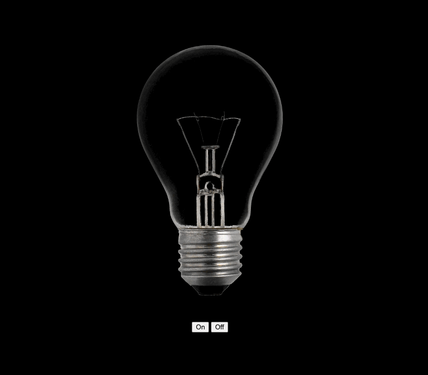

# Ligar e desligar a luz com Javascript

Projeto utilizando o Javascript para ligar e desligar uma lâmpada. Esse projeto foi baseado em uma publicação que vi no LinkedIn, mas infelizmente não lembro o nome da pessoa que fez e nem consegui baixar o código (pois só pensei em fazer um baseado no dele depois de algum tempo)

## Tecnologias utlizadas
-HTML
-CSS
-Javascritp

## Dificuldades no projeto
-Fazer o projeto funciona utilizando apenas um botão
-Deixar as duas imagens do mesmo tamanho
-Criar o código no JS

## O que aprendi com o projeto
Consegui compreender um pouco mais do universo do Javascript e entender um pouco mais sobre as variáveis, e como selecionar os elementos e trabalhar com eles no js
